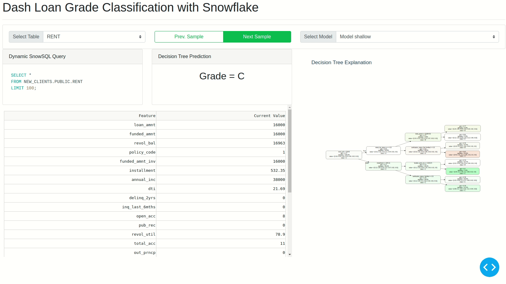

# Dash Interest Rate Modeling (with Snowflake)

This app shows how to query loan data from a Snowflake Data Warehouse, and train and analyze a Ridge regression model using Dash.



## Model Training/Data Generation

In order to train the decision tree, as well as generate the various CSV files included, please refer to the Notebook "Train Decision Trees". You will need that to create `rent.csv`, `mortgage.csv`, `owner.csv`.

## Setting up Snowflake DB

This app uses a Snowflake database for querying the data used to train the model. If you are not familiar, check out the [Snowflake Docs](https://docs.snowflake.com/en/).

### Datasets

The data used was retrieved and modified from the [Lending Club Loan Data](https://www.kaggle.com/wendykan/lending-club-loan-data) from Kaggle. By using this dataset, you are agreeing to Kaggle's terms of use, as well as the original data license. You can download the modified files here:
* `clean_loan.csv`: [Link](https://plotly-tutorials.s3-us-west-1.amazonaws.com/dash-sample-apps/snowflake-demos/clean_loan.csv)
* `loan_desc.csv`: [Link](https://plotly-tutorials.s3-us-west-1.amazonaws.com/dash-sample-apps/snowflake-demos/loan_desc.csv)

### Initialization and Env Variable

You will need to create a warehouse, a database, and a stage. We recommend using the Web Interface (please refer to the docs).

For our app, we named our warehouse "snowflake_demos", our stage "LOAN_STAGE" and our database "LOANS". If you use any other name, please update the snowflake variables in `app.py`.

Then, you will need to export the following environment variables (you can write it in your `.bashrc`):
```
export FLAKE_ACCOUNT = <your_account>
export FLAKE_USER = <your_username>
export FLAKE_PW = <your_password>
```

### Upload CSV files
For uploading the CSV files, please read `upload_csv_to_snowflake.py` carefully. It automatically:
* Create or replace a table by using the columns of the CSV file
* Remove all content from the specified stage
* Put your CSV file into the stage
* Copy the CSV file from your stage to the newly created table

It's recommended not to use the name of an existing stage or table, since it will be overwritten. In our case, the database was called "NEW_CLIENTS" and we used the following table names:
* `rent.csv`: "RENT"
* `mortgage.csv`: "MORTGAGE"
* `owner.csv`: "OWNER"

To learn more about loading bulk data, please read the official Snowflake documentation.

## Setting up the app

First clone this repo:
```
git clone https://github.com/plotly/dash-sample-apps.git
cd dash-sample-apps/apps/dash-interest-rate
```

Create a conda env (or venv) and install the requirements:
```
conda create -n dash-loan-grade python=3.6.7
conda activate dash-loan-grade
pip install -r requirements.txt
```


## Start the app

Start a redis server:
```
redis-server --port 7777
```

In a separate terminal window, you can now run the app:
```
python app.py
```

and visit http://127.0.0.1:8050/.